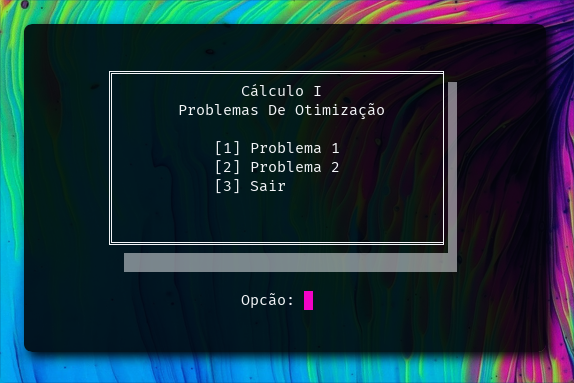

# Aplicação - Calcúlo I
## Problemas de Otimização
Aplicação feita em C que resolve dois problemas propostos em sala da Disciplina de Cálculo I do curso de Análise e Desenvolvimento de Sistemas ofertado pelo Instituto Federal de São Paulo.

É aconselhável compilar e executar o programa em um sistema derivado de unix ou entao pelo site https://www.onlinegdb.com/

#### Problema 1:

Um recipiente cilíndrico, aberto em cima, deve ter a capacidade de 375π cm³. O Custo do material usado para a base do recipiente é de R$0,15 por cm² e custo do material usado na lateral é de R$0,05 por cm². Se não há perda de material, determine as dimensões que minimizam o custo do material para construí-lo.

##### Solução:

Base: 36.61cm²
Lateral: 219.69cm²
Custo da base: R$5.49
Custo da lateral: R$10.98
Custo da embalagem: R$16.48

#### Problema 2:
Pretende-se estender um cabo de uma usina de força à margem de um rio de 900m de largura até uma fábrica situada do outro lado do rio, 3000m rio abaixo. O custo para estender um cabo pelo rio é de R$5,00 o metro, enquanto que para estendê-lo por terra custa R$ 4,00 o metro. Qual é o percurso mais econômico para o cabo?

##### Solução:

Menor Custo: R$14700,00
Por terra: R$1800,00
Por rio: R$1500,00

